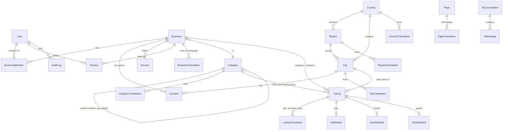

# REGA Platform — architecture

REGA is a free, multilingual directory for the Kurdish community in Germany and Europe. This page describes how it is
put together and where each decision lives. Decisions with trade-offs have an ADR in [`docs/adr`](adr).

## Principles

* **A finished house, extended in place.** The foundation (routing, shell, design tokens, data model) is stable;
  features are added next to it, not by rewriting it. Every public URL keeps working or 301-redirects.
* **Configuration drives the surfaces.** One list of sections, one list of locales; header, footer, sitemap, search and
  the assistant are generated from them.
* **Additive data model.** Migrations only add; legacy columns keep working while new tables take over new needs.
* **Free for everyone.** No pricing, paid placements, subscriptions or payment features exist in the code or the data.
* **Nothing invented.** No fake listings, reviews, people, addresses or legal facts. Missing legal details render as
  `[[PLACEHOLDER]]` (see `src/config/owner.ts`) and are listed in `CHANGES_REPORT.md`.

## Runtime

```mermaid
flowchart LR
  V[Visitor / PWA] -->|HTTPS| CF[Cloudflare Worker<br/>OpenNext + Next.js 15]
  CF --> MW[middleware: locale, 301 redirects, security headers]
  MW --> APP[App Router<br/>/[locale]/..., /dr, /api/v1]
  APP --> PG[(PostgreSQL via Prisma<br/>driver adapter, Hyperdrive optional)]
  APP --> S3[(S3-compatible media bucket)]
  APP --> EM[Email provider<br/>Resend or none]
  APP --> AI[REGA AI Gateway<br/>providers + fallback]
  APP -. advanced AI only .-> PY[Python AI Engine<br/>rerank / embeddings / processing]
  PY --> WAI[Workers AI<br/>multilingual embedding / reranking]
  APP --> RL[Rate limiter binding<br/>FORM_LIMITER etc.]
```

* **Hosting:** Cloudflare Worker `rega-platform` (`wrangler.jsonc`, built by `npm run build`). `npm run build:node` builds
  the same app for Node (used by Playwright and Docker).
* **Auth:** Auth.js v5, credentials, bcrypt (cost 12), JWT sessions. Roles: `SUPER_ADMIN`, `ADMIN`, `MANAGER`
  (moderator), `EMPLOYEE`, `BUSINESS_OWNER`, `USER` (matrix in `src/lib/rbac.ts`).
* **Errors and health:** `src/lib/logger.ts` (optional `ERROR_WEBHOOK_URL`), `/api/health`, `src/instrumentation.ts`.

## Source layout

```
src/config/            locales.ts, sections.ts (registry), owner.ts (legal facts), site.ts (constants), glossary.ts
src/features/<name>/   one folder per feature: auth, contact, content (jobs/events/guides), forms, legal, listings, reports, reviews
src/components/        shell (header, footer, nav), ui, cards, dr (dashboard forms)
src/lib/               cross-cutting services behind small interfaces: search/, email/, ai/, import/, seo, sitemap, rbac, ...
src/app/[locale]/      public pages (always locale-prefixed)
src/app/dr/            dashboard for staff and business owners (noindex)
src/app/api/v1/        REST API shared by web and apps
src/messages/*.json    UI strings for the seven locales
prisma/                schema, additive migrations, idempotent seed (+ seed-data/)
```

## Configuration-driven foundation

| Concern | Where | What it drives |
| --- | --- | --- |
| Locales | `src/config/locales.ts` | routing, `hreflang`, `og:locale`, fallbacks, column suffixes, formatting |
| Sections | `src/config/sections.ts` | header, mobile menu, footer columns, sitemap, search tabs, assistant, dashboard navigation |
| Feature flags | `src/lib/flags.ts`, `SECTIONS_ENABLED` / `SECTIONS_DISABLED` | switch a section or feature on/off without a code change |
| Environment | `src/lib/env.ts` + `.env.example` | validated at start-up; a test keeps both in sync |
| Owner / legal facts | `src/config/owner.ts` (`LEGAL_*` env) | Impressum, privacy, terms |
| Services | `src/lib/email`, `src/lib/search`, `src/lib/ai`, `src/lib/storage` | one interface each; the implementation is swapped in one place |

## Data model

Legacy per-language columns (`nameCkb`, `nameKmr`, `nameDe`, …) remain authoritative for the seven launch locales.
`*Translation` tables carry any further language and the newer entities, so adding a language needs no migration of
existing rows (ADR 0002). Content sections share one core table (`Listing`) with 1:1 typed detail tables (ADR 0003).



Status workflow (businesses, services, content listings): `draft → pending → published → archived`. Owners and employees
can only *submit*; moderators (`MANAGER` and up) publish, reject (back to draft) and archive. Reviews go
`pending → approved | rejected`. Moderation actions write an `AuditLog` row.

Other entities: `Account`/`Session`/`VerificationToken` (Auth.js; verification tokens store only a SHA-256 hash and a
purpose), `Media`, `Setting`, `FeatureFlag`, `Report` (content reports, Digital Services Act; they reference the reported URL, not a foreign key), `ContactMessage`,
`AiUsageDaily`.

## Request flow of a content page

1. `middleware.ts` resolves the locale prefix, applies 301s (old category URLs) and security headers.
2. The route (`src/app/[locale]/jobs/page.tsx`) checks `sectionEnabled("jobs")` and renders a feature component.
3. `features/content/queries.ts` reads published rows only (`status = published`, not deleted, jobs not expired).
4. Texts come from `pickTranslation`: the visitor's language, else the locale's fallback chain; a text shown in another
   language is wrapped with its own `lang`/`dir`.
5. Metadata (`pageMetadata`, 120–155-character description), JSON-LD (`JobPosting`, `Event`, `Article`) and a report link are
   added; the sitemap lists the entry in `/sitemaps/<section>-N.xml` with all locale alternates.

## Search and the assistant

`src/lib/search` exposes `SearchService` (Postgres today: substring search over denormalised, letter-folded `searchText`
columns with trigram indexes). Each section contributes a `SectionRetriever`; REGA Assistant is *grounded*: the retrieved
rows are the only facts the model may use, and with no match the answer is deterministic ("nothing found") without a model
call. When `AI_SERVICE_URL` and `AI_SERVICE_TOKEN` are configured, those already-trusted candidates may be semantically
reranked by the isolated Python AI engine before prompt assembly. Python never performs primary database retrieval and
cannot introduce a record that REGA did not retrieve. Any Python timeout, outage or malformed response preserves the
original Postgres order and the existing AI Gateway continues normally. Simple provider calls do not use Python.
Conversations are deleted after 30 days (`AI_RETENTION_DAYS`). See `docs/PYTHON-AI-ENGINE.md`.

## URLs

| URL | Notes |
| --- | --- |
| `/{locale}/businesses`, `/businesses/{category}` | category pages; `?category=<id>` 301-redirects to the slug URL |
| `/{locale}/city/{city}`, `/city/{city}/{category}` | geography pages |
| `/{locale}/business/{slug}` | canonical business page; `/businesses/{slug}` 308-redirects |
| `/{locale}/jobs`, `/events`, `/guides` (+ `/{slug}`) | content sections |
| `/{locale}/p/{slug}` | CMS pages |
| `/sitemap.xml` → `/sitemaps/*.xml` | index and chunk files of at most 2,000 records × 7 locales |

## Security and privacy

CSP and security headers (`next.config.ts`), per-IP and per-account rate limits, honeypot on public forms, no secrets in the
repository, essential cookies only (no consent banner), AI data retention, DSA report form. See ADRs 0005–0007.

## Quality gates

`npm run lint`, `npm run typecheck`, `npm test` (unit), `npm run build:node`, `npm run e2e` (Playwright + axe), and the
Workers build with `wrangler deploy --dry-run`; all in `.github/workflows/ci.yml`.
